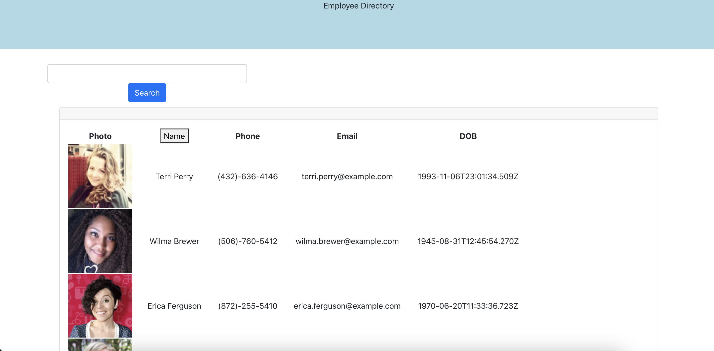
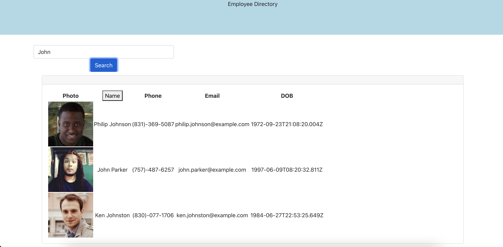

# React Employee Directory

## Table of Contents
* [Description](#description)

* [Screenshots](#screenshots)

* [Deployed App](#deployed-app)

* [Installation](#installation)

* [Usage](#usage)

* [Questions](#questions)

## Description
This application was built using react and allows the user to search their employee database. For the purposes of this app, a random generation of employees has been used.

## Screenshots

## Deployed App
https://grahamelphick.github.io/employee_directory/

## Installation
npm install

## Usage
Clone repo, npm install, npm start

OR

Run deployed app

## License
This application is covered under the MIT license.

## Questions
My GitHub: https://github.com/grahamelphick

If you have any further questions, you can reach me at: 